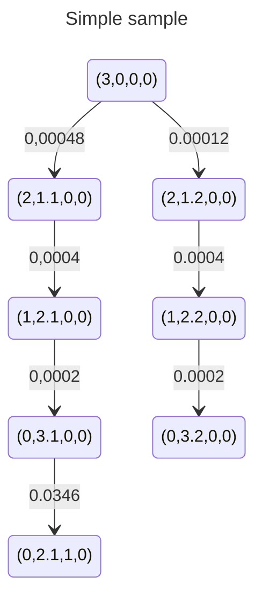

legend (Delay_station,CPU.Stage,IO1,IO2)

```mermaid
---
title: Simple sample
---
stateDiagram-v2
%%initial state

%%all clients to cpu

(3,0,0,0) --> (2,1.1,0,0)  :  0,00048 
(2,1.1,0,0) --> (1,2.1,0,0) : 0,0004
(1,2.1,0,0) --> (0,3.1,0,0) : 0,0002
(3,0,0,0) --> (2,1.2,0,0) : 0.00012
(2,1.2,0,0) --> (1,2.2,0,0) : 0.0004
(1,2.2,0,0) --> (0,3.2,0,0) : 0.0002

#
(0,3.1,0,0) --> (0,2.1,1,0) : 0.0346
```